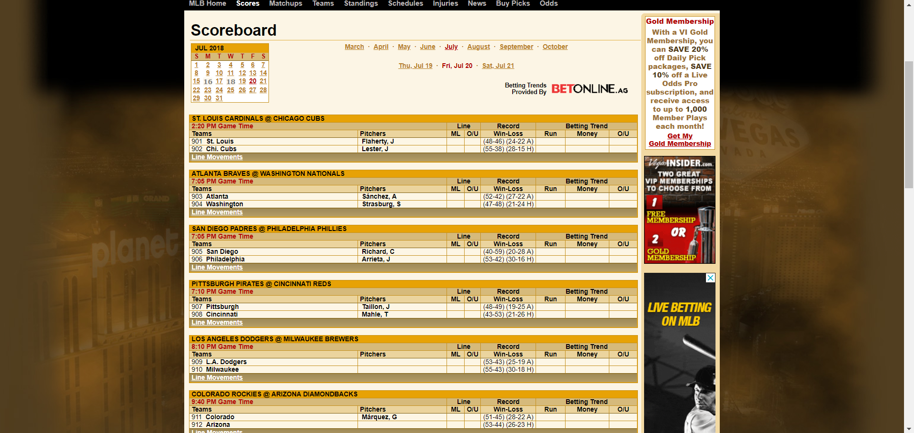

#Sports-Junkies

We wanted to come up with an application that allows people to do find a one-stop-shop within the world of "sports betting." We designed 
an app that would enable the average sports gambler come to a website and find out which sports teams are being betted on the most.
He/she can come to our webpage, login and keep track of their bets. We added an API from Fox Sports so they could also see the most 
popular headlines in sports.  We also added a "scraping" feature from Twitter, customers will be able to see what the top 5 experts were 
saying about which athelete, team, franchise owners etc. were doing in the industry. This would help them narrow down their bets. 

For front-end we used HTML, CSS and REACT
For the database we used MongoDB
For API we used Fox Sports and we added Scraping from Twitter.

#MERN APP

#This app is to keep track of all the sports you are betting on, and provide you with the knowledge to make the best possible wagers

#Find a live version at https://voyage-saucisson-23031.herokuapp.com/

#login page

#Bets Screen

#Utilizes cheerio to scrape VegasInsider for Betting Info

